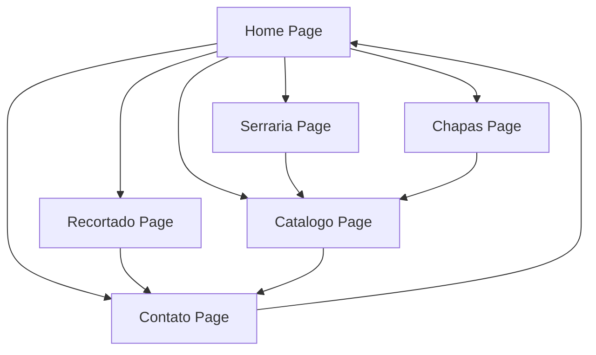

## 1. Product Overview

Repaginação completa do site DW Granitos e Mármores LTDA com foco em design moderno, fluido e responsivo. O projeto visa manter todo o conteúdo existente e sistema de internacionalização (i18n) enquanto implementa uma experiência visual aprimorada com animações suaves, layout contemporâneo e otimização de performance.

O site é voltado para clientes B2B e B2C do setor de transformação de pedras naturais, com ênfase em portfólio de serviços, catálogo de materiais e demonstração de projetos realizados.

## 2. Core Features

### 2.1 User Roles
| Role | Registration Method | Core Permissions |
|------|---------------------|------------------|
| Visitor | No registration required | Browse all content, view catalog, contact forms |
| Admin | Backend authentication | Manage content, update catalog, view contact submissions |

### 2.2 Feature Module

O site repaginado consiste nos seguintes elementos principais:

1. **Home Page**: Hero section moderno com animações, seção sobre a empresa, estatísticas, processo de trabalho, qualidade e certificações, projetos realizados, setores de atuação, parceiros comerciais e call-to-action final.

2. **Páginas de Setores**: Serraria, Chapas e Recortado com descrições detalhadas, equipamentos, processo de trabalho e galerias.

3. **Catálogo de Materiais**: Sistema de filtragem por tipo e cor, visualização em grid responsivo, modal de detalhes para cada material.

4. **Contato**: Formulário de contato integrado com WhatsApp, informações de horário e localização.

5. **Sistema de Tradução**: Suporte completo para Português, Inglês e Espanhol.

### 2.3 Page Details

| Page Name | Module Name | Feature description |
|-----------|-------------|---------------------|
| Home | Hero Section | Animação de entrada suave com logo flutuante, título com efeito de digitação, botões CTA com hover effects e background com gradiente animado |
| Home | Navigation | Header fixo com blur effect ao scroll, menu hamburger para mobile, transições suaves entre seções |
| Home | About Section | Cards flutuantes com hover animations, imagem com parallax effect, estatísticas com contador animado |
| Home | Process Timeline | Timeline vertical/horizontal responsiva com animação de progresso, ícones animados ao scroll |
| Home | Projects Gallery | Cards 3D com efeito de profundidade, imagens com lazy loading e zoom on hover |
| Home | Partners Carousel | Carousel automático com pausa on hover, logos com grayscale-to-color transition |
| Home | Quality Section | Badges animados com icones, cards com gradiente dinâmico |
| Catalog | Filter System | Filtros instantâneos com animação de fade, contador de resultados dinâmico |
| Catalog | Material Cards | Grid masonry layout, imagens com skeleton loading, modal com transição suave |
| Contact | Form Integration | Validação em tempo real, submit com loading state, mensagem de sucesso animada |
| Contact | WhatsApp Widget | Botão flutuante com pulse animation, chat modal com animação de slide |
| All Pages | Footer | Links com underline animado, social icons com hover effects, newsletter signup |
| All Pages | Scroll Animations | Fade in up, slide in left/right, scale in conforme o scroll da página |

## 3. Core Process

**Fluxo do Visitante:**
1. Usuário acessa a home page com carregamento animado
2. Navega pelas seções com scroll suave e animações progressivas
3. Explora os setores através de cards interativos
4. Visualiza o catálogo com filtros dinâmicos
5. Entra em contato via formulário ou WhatsApp
6. Visualiza projetos realizados e parceiros

**Fluxo de Navegação Mobile:**
1. Menu hamburger com animação de transformação em X
2. Navegação fullscreen overlay com links animados
3. Fechamento automático após seleção de página

## 4. User Interface Design

### 4.1 Design Style
- **Cores Primárias**: Marrom vinho (#772c2c) e bege claro (#e1e2cc) - mantendo identidade visual existente
- **Cores Secundárias**: Gradientes modernos com transições suaves entre tons terrosos
- **Botões**: Estilo glassmorphism com bordas arredondadas, hover effects com scale e shadow
- **Tipografia**: Fonte sans-serif moderna (Inter ou similar), hierarquia clara com tamanhos responsivos
- **Layout**: Card-based design com espaçamento generoso, grid system flexível
- **Ícones**: Lucide React com animações de stroke e fill transitions
- **Animações**: Framer Motion para transições fluidas, spring physics para interações naturais

### 4.2 Page Design Overview

| Page Name | Module Name | UI Elements |
|-----------|-------------|-------------|
| Home | Hero | Logo com entrada animada, headline com typewriter effect, CTA buttons com gradiente hover, background com aurora animation |
| Home | Navigation | Header semi-transparente com backdrop-blur, menu items com underline animado, language switcher com dropdown suave |
| Home | About | Grid alternado com imagens e texto, cards com hover lift effect, números com contador animado |
| Home | Process | Timeline vertical com steps animados, progress indicator dinâmico, ícones com morphing animation |
| Home | Projects | Masonry grid com cards expansivos, imagens com parallax suave, badges com color shift |
| Home | Partners | Logo carousel com fade transitions, hover state com scale e opacity |
| Catalog | Filter Bar | Toggle buttons com estado ativo animado, search com icon morphing, result counter dinâmico |
| Catalog | Material Grid | Cards com aspect ratio consistente, loading skeleton animado, modal com backdrop blur |
| Contact | Form | Input fields com floating labels, submit button com loading spinner, success message com check animation |
| Contact | WhatsApp | Floating button com pulse effect, chat modal com slide-in animation, close button com morphing |

### 4.3 Responsiveness
- **Desktop-first approach**: Design otimizado para telas grandes (1920px+)
- **Breakpoints**: 1536px, 1280px, 1024px, 768px, 640px, 390px
- **Mobile adaptations**: Menu hamburger, cards empilhados, fontes ajustadas, touch-friendly buttons
- **Touch interactions**: Swipe gestures para carousels, tap targets mínimos de 44px
- **Performance**: Lazy loading para imagens, code splitting por página, animações GPU-accelerated

### 4.4 Animações e Microinterações
- **Scroll-triggered animations**: Fade in up, slide in, scale in baseado no viewport
- **Hover states**: Scale(1.05), shadow-lg, color transitions com 300ms ease
- **Loading states**: Skeleton screens, shimmer effect, progress indicators
- **Form interactions**: Floating labels, validation feedback, success/error states
- **Page transitions**: Fade entre páginas, loading skeleton durante fetch de dados