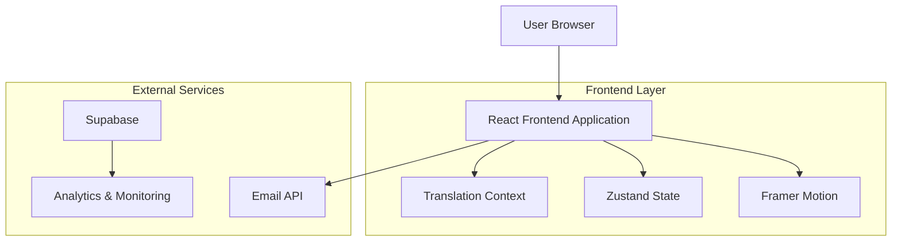

## 1. Architecture design



## 2. Technology Description

- **Frontend**: React@18 + TypeScript + Vite
- **Styling**: TailwindCSS@3 + PostCSS + Autoprefixer
- **Animations**: Framer Motion + CSS Animations
- **State Management**: Zustand para estado global leve
- **Icons**: Lucide React + Custom SVG icons
- **Routing**: React Router DOM v7
- **Forms**: React Hook Form + Zod validation
- **Email**: Nodemailer via API route
- **Analytics**: Vercel Analytics (opcional)
- **Build Tool**: Vite com TypeScript
- **Package Manager**: npm

### Dependências Essenciais:
```json
{
  "dependencies": {
    "react": "^18.3.1",
    "react-dom": "^18.3.1",
    "react-router-dom": "^7.9.5",
    "framer-motion": "^11.0.0",
    "lucide-react": "^0.511.0",
    "zustand": "^5.0.8",
    "clsx": "^2.1.1",
    "tailwind-merge": "^3.0.2",
    "react-hook-form": "^7.50.0",
    "zod": "^3.22.0"
  },
  "devDependencies": {
    "@types/react": "^18.3.12",
    "@types/react-dom": "^18.3.1",
    "@vitejs/plugin-react": "^4.4.1",
    "typescript": "~5.8.3",
    "vite": "^6.3.5",
    "tailwindcss": "^3.4.17",
    "autoprefixer": "^10.4.21",
    "postcss": "^8.5.3"
  }
}
```

## 3. Route definitions

| Route | Purpose |
|-------|---------|
| / | Home page com hero animado, sobre, processos, projetos |
| /serraria | Página de serraria com equipamentos e processos |
| /chapas | Página de chapas com especificações e aplicações |
| /recortado | Página de recortado com exemplos e precisão |
| /catalogo | Catálogo de materiais com filtros e modal |
| /contato | Formulário de contato integrado com WhatsApp |

## 4. Component Architecture

### 4.1 Core Components Structure
```
src/
├── components/
│   ├── layout/
│   │   ├── Header.tsx          # Navigation com mobile menu
│   │   ├── Footer.tsx          # Footer com links animados
│   │   ├── Layout.tsx          # Wrapper principal
│   │   └── WhatsAppFloat.tsx   # Botão flutuante com pulse
│   ├── ui/
│   │   ├── Button.tsx          # Botão genérico com variants
│   │   ├── Card.tsx            # Card com hover effects
│   │   ├── Modal.tsx           # Modal com backdrop blur
│   │   ├── Input.tsx           # Input com floating label
│   │   └── Loading.tsx         # Skeletons e spinners
│   ├── sections/
│   │   ├── Hero.tsx            # Hero com animações complexas
│   │   ├── About.tsx           # Sobre com parallax
│   │   ├── Process.tsx         # Timeline animada
│   │   ├── Projects.tsx        # Masonry grid com hover
│   │   ├── Partners.tsx        # Logo carousel
│   │   └── Quality.tsx         # Badges animados
│   └── animations/
│       ├── ScrollReveal.tsx    # Wrapper para scroll animations
│       ├── Counter.tsx         # Counter animado
│       └── Typewriter.tsx      # Typewriter effect
```

### 4.2 Animation System
```typescript
// Framer Motion variants para reuso
export const fadeInUp = {
  initial: { opacity: 0, y: 60 },
  animate: { opacity: 1, y: 0 },
  transition: { duration: 0.6, ease: "easeOut" }
};

export const scaleIn = {
  initial: { scale: 0.8, opacity: 0 },
  animate: { scale: 1, opacity: 1 },
  transition: { duration: 0.4, ease: "easeOut" }
};

export const slideInLeft = {
  initial: { x: -100, opacity: 0 },
  animate: { x: 0, opacity: 1 },
  transition: { duration: 0.8, ease: "easeOut" }
};
```

## 5. State Management

### 5.1 Zustand Stores
```typescript
// UI Store para estados de interface
interface UIStore {
  isMenuOpen: boolean;
  isLoading: boolean;
  language: 'pt' | 'en' | 'es';
  toggleMenu: () => void;
  setLoading: (loading: boolean) => void;
  setLanguage: (lang: 'pt' | 'en' | 'es') => void;
}

// Catalog Store para filtros
interface CatalogStore {
  searchTerm: string;
  selectedType: string;
  selectedColor: string;
  setSearchTerm: (term: string) => void;
  setSelectedType: (type: string) => void;
  setSelectedColor: (color: string) => void;
  resetFilters: () => void;
}
```

## 6. Performance Optimization

### 6.1 Image Optimization
- **Lazy Loading**: Intersection Observer para imagens fora do viewport
- **WebP Format**: Conversão automática com fallback para JPEG/PNG
- **Responsive Images**: srcset para diferentes tamanhos de tela
- **Placeholder**: Blur-up technique com imagem em base64

### 6.2 Code Splitting
```typescript
// Lazy loading de páginas
const Catalogo = lazy(() => import('@/pages/Catalogo'));
const Serraria = lazy(() => import('@/pages/Serraria'));
const Chapas = lazy(() => import('@/pages/Chapas'));
const Recortado = lazy(() => import('@/pages/Recortado'));
const Contact = lazy(() => import('@/pages/Contact'));
```

### 6.3 Animation Performance
- **GPU Acceleration**: Transform e opacity apenas
- **Reduced Motion**: Respeitar preferências do usuário
- **Intersection Observer**: Animar apenas elementos visíveis
- **Memoization**: React.memo para componentes pesados

## 7. Accessibility

### 7.1 WCAG 2.1 Compliance
- **Keyboard Navigation**: Tab order lógico, focus visible
- **Screen Readers**: ARIA labels, semantic HTML
- **Color Contrast**: Ratio mínimo 4.5:1 para texto
- **Reduced Motion**: Media query prefers-reduced-motion

### 7.2 Form Accessibility
```typescript
// Exemplo de input acessível
<input
  id="name"
  type="text"
  aria-label="Nome completo"
  aria-required="true"
  aria-invalid={errors.name ? 'true' : 'false'}
  aria-describedby={errors.name ? 'name-error' : undefined}
/>
```

## 8. SEO e Meta Tags

### 8.1 Dynamic Meta Tags
```typescript
// Hook para meta tags dinâmicas
export const useMetaTags = (title: string, description: string, image?: string) => {
  useEffect(() => {
    document.title = `${title} | DW Granitos`;
    
    // Open Graph
    const metaTags = [
      { name: 'description', content: description },
      { property: 'og:title', content: title },
      { property: 'og:description', content: description },
      { property: 'og:image', content: image || '/og-image.jpg' },
      { property: 'og:type', content: 'website' },
      { name: 'twitter:card', content: 'summary_large_image' },
    ];
    
    metaTags.forEach(tag => {
      const element = document.querySelector(`meta[name="${tag.name}"], meta[property="${tag.property}"]`);
      if (element) {
        element.setAttribute('content', tag.content || tag.name);
      }
    });
  }, [title, description, image]);
};
```

### 8.2 Structured Data
```typescript
// JSON-LD para SEO
export const organizationSchema = {
  '@context': 'https://schema.org',
  '@type': 'Organization',
  name: 'DW Granitos e Mármores LTDA',
  url: 'https://dwgranitos.com.br',
  logo: 'https://dwgranitos.com.br/logo.png',
  contactPoint: {
    '@type': 'ContactPoint',
    telephone: '+55-28-99905-7492',
    contactType: 'customer service',
    areaServed: 'BR',
    availableLanguage: ['Portuguese', 'English', 'Spanish']
  },
  sameAs: [
    'https://wa.me/552899057492',
    'https://www.instagram.com/dwgranitos'
  ]
};
```

## 9. Deployment Configuration

### 9.1 Vercel Configuration
```json
{
  "buildCommand": "npm run build",
  "outputDirectory": "dist",
  "devCommand": "npm run dev",
  "installCommand": "npm install",
  "rewrites": [
    {
      "source": "/api/(.*)",
      "destination": "/api/$1"
    },
    {
      "source": "/(.*)",
      "destination": "/index.html"
    }
  ],
  "headers": [
    {
      "source": "/(.*)",
      "headers": [
        {
          "key": "X-Content-Type-Options",
          "value": "nosniff"
        },
        {
          "key": "X-Frame-Options",
          "value": "DENY"
        },
        {
          "key": "X-XSS-Protection",
          "value": "1; mode=block"
        }
      ]
    }
  ]
}
```

### 9.2 Build Optimization
```typescript
// vite.config.ts
export default defineConfig({
  plugins: [react()],
  build: {
    rollupOptions: {
      output: {
        manualChunks: {
          'react-vendor': ['react', 'react-dom'],
          'motion-vendor': ['framer-motion'],
          'ui-vendor': ['lucide-react'],
          'utils-vendor': ['clsx', 'tailwind-merge']
        }
      }
    },
    target: 'es2015',
    minify: 'terser',
    terserOptions: {
      compress: {
        drop_console: true,
        drop_debugger: true
      }
    }
  },
  optimizeDeps: {
    include: ['react', 'react-dom', 'framer-motion']
  }
});
```

## 10. Testing Strategy

### 10.1 Unit Testing
- **Components**: Testar renderização e interações
- **Hooks**: Testar lógica e estados
- **Utils**: Testar funções puras
- **Stores**: Testar actions e state changes

### 10.2 E2E Testing
- **Navigation**: Testar fluxo completo do usuário
- **Forms**: Testar validação e submissão
- **Animations**: Testar comportamento em diferentes viewports
- **Performance**: Testar load time e animations smoothness

### 10.3 Accessibility Testing
- **Keyboard**: Navegação completa via teclado
- **Screen Reader**: Testar com NVDA/VoiceOver
- **Color Contrast**: Validar contraste em todos os elementos
- **Semantic HTML**: Validar estrutura correta